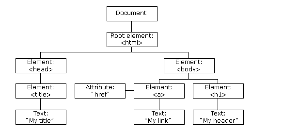

# **JavaScript DOM**

> **Apa itu DOM**

DOM adalah singkatan dari _Document Object Model_. DOM merupakan antarmuka pemrograman untuk dokumen web. Bagaimana cara kerja DOM? Karena ia berbentuk _object_ maka seluruh elemen dari dokumen dapat diakses dan dimanipulasi. Antarmuka DOM berisi : Elemen HTML dalam _object document_, properti dari elemen HTML tersebut, _method_ untuk mengakses elemen HTML dan juga _event_ yang terjadi pada elemen HTML. DOM dapat diilustrasikan seperti pohon.

```html
<html>
  <head>
    <title>My Title</title>
  </head>
  <body>
    <a href="#">
      My Link
    </a>
    <h1>
      My Header
    </h1>
  </body>
</html>
```


> **Apa saja yang dapat dimanipulasi**

Nilai-nilai yang dapat kita manipulasi dari elemen HTML disebut _DOM properties_

Berikut diantaranya :

1. Gaya elemen

Dapat diakses lewat ```element.style.property```

2. Konten HTML

Bisa diakses melalui ```element.innerHTML```

> **Apa saja yang dapat kita lakukan**

1. Mengakses sebuah elemen lewat _CSS selector_ dengan sintaks ```document.querySelector(selector)```

2. Membuat sebuah elemen dengan sintaks ```document.createElement(element)```

3. Menghapus elemen dengan sintaks ```element.remove()```